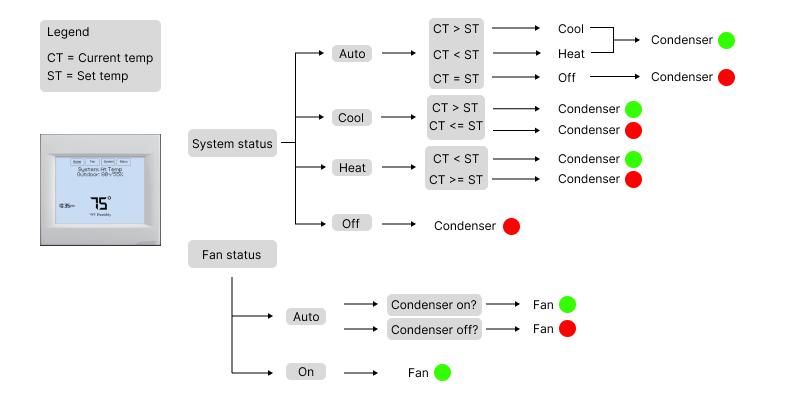

# A/C Simulation

[Concept Description](#concept-description)  
[Installation Instruction](#installation-instructions)  
[Solution Diagram](#use-case-diagram)  
[Dev Dependencies](#dependencies)  

## Concept Description
The plan for this project is to simulate an A/C System. The first version will include a digital recreation of a thermostat with the same functionality and logic as a real thermostat.
The end goal of this project is to integrate and simulate condensers and air handlers into the system that are controlled via the thermostat. I plan on being able to show what is happening real time in a system. This project has the potential to simulate various components at different levels of complexity. Electrical simulation would also be a big achievement to stride towards.

## Installation Instructions

### Live site (Coming soon...)

### Self host
1. Clone the repository
2. Install dependencies (npm install)
3. Run the project (npm start)
4. Open browser to localhost

## Use Case Diagram

## Dependencies
* node: ^20.14.7
* react:  ^18.2.66
* react-dom: ^18.2.22
* typescript: ^5.2.2
* vite: ^5.2.0
* eslint: ^8.57.0

